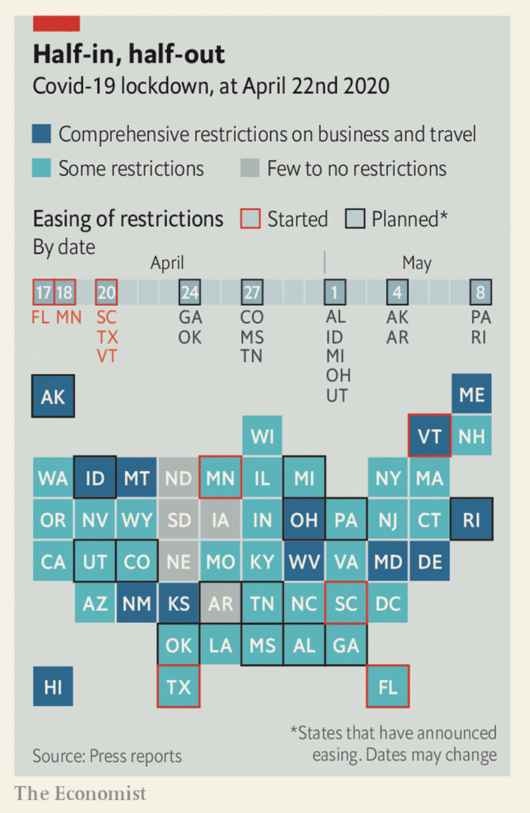

[Back to Home Page](/README.md)

# Assignment 3 and 4

## Intro

### Article:[America begins easing restrictions](https://www.economist.com/united-states/2020/04/23/america-begins-easing-restrictions)
##### -- The country is adopting a half-in, half-out approach to lockdowns

#### Reason for choosing:
I picked this article because the chart is very unique. It is a combination of two charts consisting of many information. Almost showing gradual changing progress. It also minimalized the U.S. map into equally large cubes of states for the audiences to compare and contrast.

#### (My summary) of the Article's topic: 
States are easing the COVID-19 restrictions and the outcome of the easing restrictions is unpredictable.

#### Chart chosen: 

#### Chart's Message:
The chart represents detailed facutal information about how each state’s plans to ease restriction (show how different restriction strengths are applied to states next to each other).

## Chart Crititque

### Google SpreedSheet 
* #### Usefulness -- 8
reasoning: the chart provides sufficient information for the viewer to understand what is going on in each state, the intensity of their current restriction and the exact date of the decision to ease the current restriction.

* #### Understandable -- 10
reasoning: the use of text is sufficient that there is no redundant information except for the pieces of information needed for the audiences to understand the content.

* #### Perceptibility -- 6
reasoning: the chart sees to be more factual than declaring some message. It’s complexity also doesn’t help the audiences to see the “half-in, half-out” spot on. It is important to present the fact as accurately as possible but some variables may be reduced from the chart. 

* #### Truthfulness -- 10
reasoning: the information represented in the chart is truthful and detailed.

* #### Intuitiveness -- 9
reasoning: very intuitive and the descriptive text on the chart makes it easy to figure out.

* #### Aesthetis -- 9
reasoning: the chart is aesthetically appealing. The well use of color creates a nice balance between the complicated information consisted by the chart.

* #### Engagement -- 9
reasoning: the text wrapping around the chart tells more about how America is unprepared for the easing restrictions and how unpredictable this will end up like. However, the chart doesn’t really echo with the text. 

* #### What I would do?
I don’t think the exact dates of staring or planned easing of restriction is necessary to illustrate “in” and “out” sates. I also would like to try using color instead of red and black frames to represent an easing of restrictions. Overall, I think the important message of this chart is to show the audience how the states are on easing restriction.

* #### Who is the primary audience for this tool? Do you think this visualization is effective for reaching that audience? Why or why not? 
The targeted audience would be the magazine’s subscribers who care (concern) about the pandemic and who look closely on the government's action.

* #### Final thoughts on the method of evaluation
Overall, the method is effective in that it covers all the important aspects of a chart in an article to consist of. 

## Wireframe Redesign
### Intro
For this part of the assignment I chose to use hand drawing to create wireframes of my three redesign ideas.

## Summary

[Back to Home Page](/README.md)

